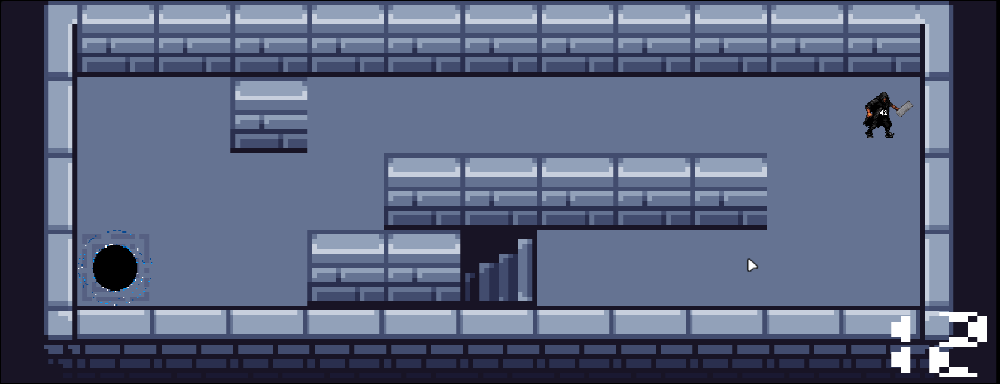

# 🎮 so_long

#### ✅ [125/125]

## ✨ 42 Adventure: The Ultimate Escape from the Blackhole! ✨

**so_long** is a 2D game built as part of the 42 curriculum, where you play as a brave student navigating through the treacherous halls of 42 School. Your mission? Collect all the moulinettes (tests) and escape through the stairs before the deadly blackhole consumes you!

The game uses the MinilibX graphics library and relies on solid algorithms for path finding and real-time rendering.

## 📋 Table of Contents

- [Features](#features)
- [Installation](#installation)
- [Game Controls](#game-controls)
- [Map Format](#map-format)
- [Game Elements](#game-elements)
- [Screenshots](#screenshots)
- [Technical Details](#technical-details)
- [Challenges Conquered](#challenges-conquered)

## ✨ Features

- **Dynamic Gameplay**: Navigate through custom maps while avoiding the ever-following blackhole!
- **Animation**: Fluid character animations bring your adventure to life
- **Enemy AI**: The blackhole pursues you intelligently - plan your moves carefully!
- **Collectibles**: Destroy all moulinettes to unlock the exit
- **Move Counter**: Track your efficiency with a move counter display
- **Explosion Effects**: Witness satisfying explosions when collecting moulinettes
- **Wall Destruction**: Watch the blackhole destroy walls in its path!

## 🔧 Installation

```bash
# Clone the repository with submodules
git clone --recursive https://github.com/yourusername/so_long.git

# Navigate to the project directory
cd so_long

# Compile the game
make

# Run the game with a map
./so_long maps/small.ber
```

### Dependencies

- MinilibX library (included as a submodule)
- X11 development libraries
- LibFT (included as a submodule)

If not using git clone with `--recursive`, initialize the submodules manually:

```bash
git submodule init
git submodule update
```

## 🎮 Game Controls

- **W**: Move up
- **A**: Move left
- **S**: Move down
- **D**: Move right
- **ESC**: Exit the game

## 🗺️ Map Format

Maps are defined in `.ber` files using the following characters:

- `1`: Wall
- `0`: Empty space
- `P`: Player starting position (must be exactly one)
- `E`: Exit/stairs (must be exactly one)
- `C`: Collectible/moulinette (must have at least one)

Example map:

```
1111111111111111
1E00000000C00001
1010010000010101
1010010101000101
1010010101000101
1P00000C000000C1
1111111111111111
```

### Map Rules

- Maps must be rectangular
- Maps must be enclosed by walls
- There must be exactly one player and one exit
- There must be at least one collectible
- There must be a valid path to collect all items and reach the exit
- Maximum dimensions: 30x15 tiles

## 🎭 Game Elements

| Element     | Description                                                                        |
| ----------- | ---------------------------------------------------------------------------------- |
| Player      | The protagonist - that's you! Collect all moulinettes and reach the exit.          |
| Moulinettes | "Collectibles" that must be destroyed before exiting. They explode on contact!     |
| Exit        | The stairs that lead to freedom, only accessible after collecting all moulinettes. |
| Blackhole   | A deadly entity that follows you after your third move. It destroys walls and you! |
| Walls       | Obstacles that block your path - but not the blackhole's!                          |

## 📸 Screenshots




## 🔧 Technical Details

This project showcases several important programming concepts:

- **Memory Management**: Careful allocation and freeing of resources
- **Data Structures**: Custom point and entity structures
- **Pathfinding**: Flood-fill algorithm for map validation
- **Event Handling**: User input management via hooks
- **Real-time Rendering**: Frame-based animation system
- **Error Handling**: Robust error checking and reporting

## 💪 Challenges Conquered

- **Efficient Rendering**: Implemented partial rendering for better performance
- **AI Pathfinding**: Created a simple but effective AI for the blackhole enemy
- **Memory Safety**: Built comprehensive memory management to prevent leaks
- **Input Responsiveness**: Fine-tuned control system for smooth gameplay
- **Animation System**: Developed a frame-based animation system for fluid movement

## License

This project is part of the 42 curriculum and follows its academic policies.
